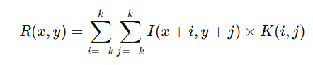
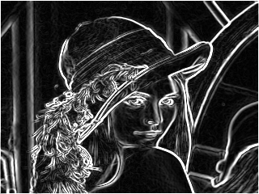
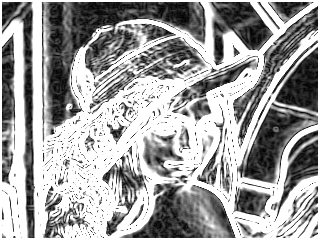
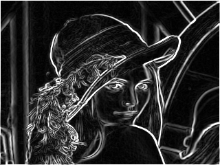
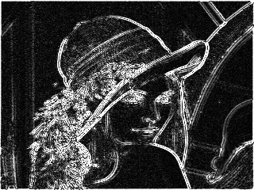
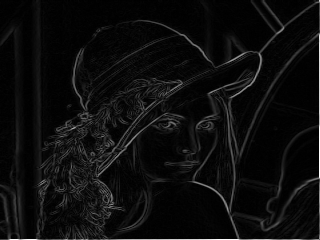

# 📑 Problema 3: Filtro Detector de Bordas com FPGA (DE1-SoC)

<div align="center">
  Docente: Wild Freitas
</div>

<div align="center">
  Discentes: Gabriel Ribeiro Souza & Lyrton Marcell & Israel Oliveira
</div>

<div align="center">
  Universidade Estadual de Feira de Santana (UEFS) - Bahia
</div>

<div align="center">
  Endereço: Av. Transnordestina, S/N - Bairro: Novo Horizonte - CEP: 44036-900
</div>

## 1. Introdução

Filtros detectores de borda são técnicas fundamentais no processamento digital de imagens, permitindo identificar transições abruptas de intensidade que correspondem aos contornos e limites dos objetos presentes em uma imagem. Este projeto tem como objetivo aplicar filtros de borda sobre imagens utilizando a plataforma DE1-SoC, com o processamento das operações de convolução acelerado via FPGA, a partir de um coprocessador especializado desenvolvido previamente.

---

## 2. Objetivos

### 2.1 Objetivo Geral

Implementar um sistema embarcado que aplica filtros detectores de bordas a imagens no formato 320×240 pixels, utilizando a DE1-SoC, com a execução das convoluções realizada por um coprocessador de multiplicação matricial na FPGA.

### 2.2 Objetivos Específicos

- ✅ Ler imagens em RGB e convertê-las para escala de cinza;
- ✅ Implementar os filtros de borda: Sobel 3×3, Sobel 5×5, Prewitt 3×3, Roberts 2×2 e Laplaciano 5×5;
- ✅ Desenvolver uma interface de comunicação entre o HPS (ARM) e a FPGA via memória mapeada;
- ✅ Criar scripts em C e Assembly para envio e recebimento de dados entre processador e FPGA;
- ✅ Exibir e salvar as imagens processadas para validação visual.

---

## 3 Fundamentação Teórica

### 3.1 Convolução

A **convolução** é uma operação fundamental no processamento digital de imagens. Trata-se de um processo matemático que aplica uma matriz de pesos (chamada **máscara** ou **kernel**) sobre a imagem para realçar certas características, como **bordas**, **texturas** e **detalhes**.

O funcionamento é o seguinte:

- Uma **janela de pixels** (normalmente 3×3, 5×5 ou outro tamanho ímpar) é movida sobre toda a imagem.
- Em cada posição, os valores dos pixels dentro da janela são multiplicados pelos valores correspondentes no kernel.
- Os produtos obtidos são somados, e o resultado é atribuído ao pixel central da janela na imagem de saída.
- Esse procedimento é repetido para todos os pixels da imagem.

**Matematicamente:**



**Onde:**

- `R(x, y)` é o valor do pixel na posição (x, y) da imagem resultante.
- `I(x+i, y+j)` é o valor do pixel da imagem original na posição (x+i, y+j).
- `K(i, j)` é o valor da máscara na posição (i, j).
- `k` depende do tamanho do kernel (ex.: 1 para 3×3, 2 para 5×5).

A convolução é extremamente útil para operações como **detecção de bordas**, **suavização**, **realce de detalhes** e **remoção de ruído**.

---

## 3.1.1 Tratamento de Overflow

Durante o processo de convolução, os valores resultantes podem exceder a faixa de representação de pixels (0-255 para imagens de 8 bits). Para lidar com esse overflow, foi implementada uma etapa de saturação, onde quaisquer valores resultantes da convolução que estejam abaixo de 0 são ajustados para 0, e valores acima de 255 são ajustados para 255. Isso garante que a imagem de saída mantenha a integridade visual e os valores de pixel permaneçam dentro do intervalo válido.

---

### 3.2 Filtros de Detecção de Bordas

Filtros detectores de bordas são operadores baseados em convolução que identificam regiões de transição abrupta de intensidade na imagem, locais onde há uma variação rápida entre tons claros e escuros. Cada filtro possui suas particularidades no cálculo dos gradientes e sensibilidade a ruídos e detalhes.

Abaixo, detalhamos os filtros utilizados neste projeto:

| Filtro        | Descrição Detalhada |
|:--------------|:--------------------|
| **Sobel 3×3**  | Filtro derivativo de primeira ordem que utiliza dois kernels, um para o gradiente na direção horizontal (**Gx**) e outro na vertical (**Gy**). Os pesos são maiores nas posições centrais das bordas, conferindo maior ênfase a essas regiões. Por incluir suavização, é mais robusto a ruídos do que o Prewitt. |
| **Sobel 5×5**  | Versão expandida do Sobel tradicional, onde os kernels passam de 3×3 para 5×5. Isso permite analisar uma vizinhança maior, tornando o filtro mais eficaz na detecção de bordas em imagens com muitos detalhes ou com ruídos leves, pois suaviza variações locais indesejadas. |
| **Prewitt 3×3**| Assim como o Sobel, é um filtro de primeira derivada, mas utiliza pesos uniformes no cálculo do gradiente. Por ser mais simples, é mais rápido de calcular, porém mais suscetível a ruído. Sua aplicação é semelhante à do Sobel, mas com menor precisão em imagens de baixa qualidade. |
| **Roberts 2×2**| Filtro compacto que calcula a diferença entre pixels adjacentes na diagonal. Ideal para destacar detalhes finos e contornos abruptos, mas muito sensível a ruídos. Por usar janelas 2×2, oferece alta precisão local, mas menor robustez geral. |
| **Laplaciano 5×5** | Diferentemente dos demais, é um operador de segunda derivada, ou seja, calcula a variação da variação de intensidade. Detecta regiões onde há mudanças rápidas em todas as direções. Como pode amplificar ruídos, é frequentemente combinado com pré-filtros suavizantes. A versão 5×5 permite melhor controle sobre regiões de maior variação espacial. |

---

### 3.2.1 Comparativo dos Filtros

| Filtro        | Tamanho | Tipo de Derivada | Direção Sensível       | Robustez a Ruído | Uso Ideal                                        |
|:---------------|:-----------|:----------------|:----------------------|:----------------|:-------------------------------------------------|
| **Sobel 3×3**   | 3×3        | Primeira         | Horizontal e Vertical  | Boa             | Bordas gerais com ruído moderado                 |
| **Sobel 5×5**   | 5×5        | Primeira         | Horizontal e Vertical  | Muito boa       | Bordas finas com detalhes e ruído                |
| **Prewitt 3×3** | 3×3        | Primeira         | Horizontal e Vertical  | Média           | Bordas simples em imagens limpas                 |
| **Roberts 2×2** | 2×2        | Primeira         | Diagonal               | Baixa           | Detalhes finos e transições abruptas             |
| **Laplaciano 5×5** | 5×5     | Segunda          | Todas as direções      | Baixa a Média   | Detectar regiões de alta variação geral          |

---

## 4 Metodologia

O projeto foi desenvolvido na plataforma **DE1-SoC**, combinando um processador **ARM Cortex-A9** (HPS) e uma **FPGA Cyclone V**. A metodologia foi organizada em quatro etapas principais:

### 4.1 Linguagens Utilizadas

- **C**  
  Responsável por toda a aplicação de alto nível, incluindo:
  - Leitura e redimensionamento das imagens.
  - Conversão para escala de cinza.
  - Controle do protocolo de envio e recepção de dados para a FPGA.
  - Aplicação dos filtros de detecção de borda.
  - Salvamento das imagens processadas.

- **Assembly ARM (ARMv7)**  
  Utilizado para a implementação de rotinas de comunicação de baixo nível com a FPGA, incluindo:
  - Mapeamento de memória (`/dev/mem`).
  - Escrita e leitura nos registradores da FPGA.
  - Implementação de handshakes síncronos via registradores de controle.

---

### 4.2 Bibliotecas Externas

- **stb_image**  
  Biblioteca em C para leitura de imagens nos formatos **PNG**, **JPEG** e **BMP**. Utilizada para carregar imagens RGB e obter suas dimensões.

- **stb_image_write**  
  Complementa a stb_image, permitindo salvar imagens processadas em **formato PNG** após a aplicação dos filtros.

---

### 4.3 Coprocessador de Multiplicação Matricial (FPGA)

A FPGA contém um coprocessador dedicado à multiplicação elemento a elemento de duas matrizes 5×5 (janela da imagem e kernel do filtro). Esse módulo:
- Recebe dados via registradores mapeados.
- Realiza o produto e soma acumulada.
- Retorna o resultado convolucional.
- Opera sob controle de sinais de `start`, `reset` e `ack` (acknowledge) via bits de controle.

---

### 4.4 Protocolo de Comunicação HPS ↔ FPGA

Para comunicação entre o processador ARM e a FPGA, foi implementado um protocolo baseado em:

- **Memória mapeada** via `/dev/mem` para acesso aos registradores da FPGA diretamente pelo espaço de endereçamento virtual do Linux embarcado.
- **Handshakes síncronos**, controlados por bits específicos:
  - **Bit 31 (start / ack)**: sinaliza início de envio ou leitura de dados.
  - **Bits 0–28**: utilizados para enviar os valores dos pixels, pesos dos kernels e parâmetros de operação (opcode e tamanho).

O protocolo garante integridade e sincronização entre as etapas de envio de dados, execução na FPGA e leitura dos resultados.

---

### 4.5 Fluxo Operacional

1. O usuário seleciona o filtro desejado.
2. O HPS percorre todas as imagens no diretório `input/`.
3. Para cada pixel da imagem:
   - Extrai uma janela de pixels.
   - Envia a janela e o kernel para a FPGA.
   - Solicita a operação de convolução.
   - Recebe o resultado processado.
4. Armazena os resultados na imagem de saída.
5. Salva a imagem final no diretório `output/` com identificação do filtro aplicado.

---

## 5 Desenvolvimento

Este projeto realiza processamento de imagens com filtros de detecção de bordas utilizando um coprocessador na FPGA da plataforma DE1-SoC, com interação via HPS (ARM Cortex-A9) através de memória mapeada.

### 5.1 `main.c`

Responsável pelo fluxo completo de processamento das imagens:

- Leitura e redimensionamento de imagens de entrada no diretório `input/`, utilizando `stb_image`;
- Conversão de imagens RGB para escala de cinza com base na fórmula de luminância: (0.299*R + 0.587*G + 0.114*B);
- Extração de janelas de vizinhança (2×2, 3×3 ou 5×5) ao redor de cada pixel, com tratamento de bordas (padding zero);
- Envio das janelas e kernels para a FPGA, através da função `transfer_data_to_fpga()`;
- Recepção dos resultados processados via `retrieve_fpga_results()` e reconstrução do valor final;
- Cálculo da magnitude do gradiente (`√(Gx² + Gy²)`) para filtros com duas direções (Gx/Gy), ou valor absoluto para Laplace (unidirecional);
- Saturação dos valores convoluídos para a faixa [0, 255];
- Salvamento da imagem resultante no diretório `output/` como PNG com nome indicativo do filtro utilizado.

O código também permite **seleção dinâmica do filtro desejado via terminal**:
- Sobel 3x3 / 5x5  
- Prewitt 3x3  
- Roberts 2x2  
- Laplace 5x5

---

### 5.2 `hps_0.h`

Arquivo de cabeçalho contendo:

#### 5.2.1 Definições de constantes:
- `MATRIX_SIZE` (25): representa o tamanho linear de uma matriz 5×5;
- `HW_SUCCESS` e `HW_SEND_FAIL`: códigos de retorno para interface FPGA.

#### 5.2.2 Estrutura de dados `Params` usada para empacotar os argumentos enviados à FPGA:
```c
struct Params {
  const uint8_t* a;   // Ponteiro para janela de pixels
  const int8_t* b;    // Ponteiro para kernel do filtro
  uint32_t opcode;    // Código de operação (e.g., 7 = convolução)
  uint32_t size;      // Tamanho do kernel (interpretação FPGA)
};
```
#### 5.2.3 Funções Assembly prototipadas:

```
extern int initiate_hardware(void);
extern int terminate_hardware(void);
extern int transfer_data_to_fpga(const struct Params* p);
extern int retrieve_fpga_results(uint8_t* result);
```

#### 5.2.4 Definição dos kernels de borda (todos mapeados para matrizes 5x5 com padding zero):

- sobel_gx_3x3, sobel_gy_3x3
- sobel_gx_5x5, sobel_gy_5x5
- prewitt_gx_3x3, prewitt_gy_3x3
- roberts_gx_2x2, roberts_gy_2x2
- laplace_5x5

---

### 5.3 `lib.s`

Implementação em **Assembly ARM**, responsável por intermediar a comunicação entre o **HPS** e os **registradores da FPGA** via acesso direto a `/dev/mem`.

---

#### 5.3.1 Inicialização e Finalização

##### 5.3.1.1 🟢 `initiate_hardware`

- Abre o dispositivo `/dev/mem` usando `open` (SVC 5);
- Realiza o mapeamento da região do Lightweight HPS–FPGA Bridge com `mmap2` (SVC 192);
- Inicializa os ponteiros globais:
  - `data_in_ptr` (ponteiro base para escrita);
  - `data_out_ptr` (ponteiro base para leitura).

##### 5.3.1.2 🔴 `terminate_hardware`

- Desfaz o mapeamento da memória com `munmap` (SVC 91);
- Fecha o descritor de `/dev/mem` com `close` (SVC 6);
- Zera os ponteiros globais para evitar acessos inválidos.

---

#### 5.3.2 Envio de Dados para a FPGA

##### 5.3.2.1 `transfer_data_to_fpga(struct Params* p)`

- Envia **25 pares (pixel + kernel)** de dados para o coprocessador implementado na FPGA;
- Controla os bits de sinal da transação via registradores:

| Bit | Função   |
|-----|----------|
| 29  | Reset    |
| 30  | Start    |
| 31  | Handshake (controle síncrono) |

- Aplica um **delay de ciclos (`DELAY_CYCLES`)** entre os pulsos de `reset` e `start` para sincronização;
- Utiliza a rotina auxiliar `handshake_send` para garantir a **entrega correta e confirmada** dos dados.

---

#### 5.3.3 Recepção dos Resultados

##### 5.3.3.1 `retrieve_fpga_results(uint8_t* result)`

- Recebe **25 bytes** contendo os dados processados pela FPGA;
- Utiliza a função `handshake_receive()`, que monitora o **bit 31** do registrador `data_out` para **sincronização com o coprocessador**;
- Lê os dados da FPGA com **confirmação explícita** por parte do HPS (acknowledgment handshake).

---

#### 5.3.4 Handshake

##### `handshake_send(uint32_t value)`

- Seta o **bit 31 de controle** no registrador `data_in`;
- Aguarda o reconhecimento (ACK) da FPGA via **bit 31 em `data_out`**;
- Finaliza o handshake ao limpar o valor enviado.

##### `handshake_receive(uint8_t* value_out)`

- Ativa o **bit 31** para sinalizar que o HPS está pronto para receber;
- Aguarda o envio da FPGA (também sinalizado via bit 31);
- Lê o byte transferido e confirma a leitura ao desativar o sinal.

---

### 5.4 `Makefile`

Automatiza o ciclo de compilação e execução do projeto:

#### 5.4.1 Funcionalidades:

- Compilação C (main.c) com otimizações e includes (-O2, -I.);
- Montagem Assembly (lib.s) com as;
- Linkagem final com gcc e link para -lm (biblioteca matemática);

#### 5.4.2 Alvos adicionais:

- run: executa o programa;
- clean: remove binários e objetos;
- debug: recompila com -g e abre com gdb.

---

### 5.5 `convolution.v`

Este módulo Verilog implementa o **núcleo de convolução 2D parametrizável**, responsável por aplicar o filtro (kernel) à janela de pixels recebida do HPS via registradores.


### 5.5.1 Descrição do Módulo

```verilog
module convolution (
    input  [199:0] pixel,        // Janela de pixels (5x5) - valores unsigned 8 bits
    input  [199:0] matrix_b,     // Kernel de convolução (5x5) - valores signed 8 bits
    input  [1:0]   matrix_size,  // Tamanho efetivo: 00=2x2, 01=3x3, 10=4x4, 11=5x5
    output [199:0] result_out    // Resultado expandido para 200 bits (MSBs = 0)
);
```

### 5.5.2 Funcionalidades

- Suporte a **diferentes tamanhos de kernel** (2×2 até 5×5), definidos via `matrix_size`;
- Funções auxiliares internas para:
  - Obtenção de valores individuais dos pixels e do kernel via índice linear;
  - Verificação se a posição `(row, col)` está dentro dos limites especificados pelo tamanho da matriz;
  - Conversão explícita de pixels unsigned para signed:
    ```verilog
    $signed({1'b0, pixel_val})
    ```
- **Loop aninhado 5×5** com filtragem condicional com base no tamanho do kernel (`matrix_size`);
- Acúmulo dos produtos convolucionais em `sum`, do tipo `signed [15:0]`;
- Resultado da convolução é atribuído a `conv_result` e posicionado nos **LSBs de `result_out`**, com os bits superiores zerados para compatibilidade.

---

### 5.5.3 Observações Técnicas

- O cálculo da convolução **preserva o sinal**, permitindo o uso de kernels como Sobel, Prewitt e Laplace (com valores negativos);
- A largura da saída `result_out` é **200 bits** para manter compatibilidade com o barramento, **mas apenas os 16 bits menos significativos (LSBs)** contêm o valor real;
- O mapeamento das janelas e kernels é sempre baseado em uma estrutura 5×5 fixa.  
  As posições fora da submatriz desejada (e.g. 3×3) são automaticamente **ignoradas** conforme o controle via `matrix_size`.

---

### 5.6 📄 `coprocessor.v`

Este módulo representa o **coprocessador lógico** da FPGA, responsável por executar operações sobre duas matrizes 5×5 com base no código de operação recebido.

---

#### 5.6.1 Funcionalidade

- Recebe:
  - `op_code`: código da operação (3 bits);
  - `matrix_size`: tamanho do kernel (2x2 até 5x5);
  - `matrix_a`: janela de pixels (imagem);
  - `matrix_b`: kernel/filtro.
  
- Realiza a **instanciação direta do módulo `convolution`**, que executa a multiplicação pixel a pixel entre `matrix_a` e `matrix_b`, acumulando o resultado conforme o tamanho configurado.

- A saída da operação (`result_convolution`) é atribuída a `result_final` **apenas quando `op_code == 3'b111`** (convolução).

- Sinaliza conclusão com `process_Done`.

---

#### 5.6.2 Estrutura interna

- Internamente, o módulo suporta extensão para múltiplas operações. Atualmente, apenas a operação de convolução está implementada;
- Os resultados intermediários são conectados diretamente por fios (`wire`) com o módulo `convolution`.

---

### 5.7 `control_unit.v`

Este módulo é a **unidade de controle principal** entre o **HPS e o coprocessador da FPGA**, implementada como uma FSM (Máquina de Estados Finitos).

---

#### 5.7.1 Funções principais

- Interface com o barramento HPS ↔ FPGA via registradores de 32 bits:
  - `data_in`: recebe dados enviados do HPS;
  - `data_out`: envia resultados da FPGA para o HPS.

- Executa três fases principais:
  1. **Recepção de dados** (`RECEIVING`)
  2. **Processamento no coprocessador** (`PROCESSING`)
  3. **Envio de resultados** (`SENDING`)

- Monitora sinal de handshake HPS → FPGA (`bit 31` do `data_in`) para detectar **borda de subida**.

---

#### 5.7.2 Estrutura FSM

| Estado      | Ação                                                             |
|-------------|------------------------------------------------------------------|
| `IDLE`      | Espera comando de início (`start_in`)                            |
| `RECEIVING` | Armazena elementos das matrizes A, B, e C recebidas do HPS       |
| `PROCESSING`| Aguarda sinal `done_signal` do coprocessador                     |
| `SENDING`   | Retorna os 25 resultados da matriz processada via `data_out`     |

---

### 5.7.3 Interface com o coprocessador

- **Flattening das matrizes** `matrix_a`, `matrix_b`, `matrix_c` para barramentos de 200 bits via bloco `generate`;
- **Instanciação do `coprocessor`** com os sinais necessários:
  ```verilog
  coprocessor coprocessor (
      .op_code(op_code),
      .matrix_size(matrix_size),
      .matrix_a(matrix_a_flat),
      .matrix_b(matrix_b_flat),
      .result_final(matrix_out),
      .process_Done(done_signal)
  );

  ### 5.7.4 Sincronização HPS–FPGA

- Utiliza uma **cadeia de registradores** (`hps_ready_sync`) para detectar **bordas de subida** no sinal `hps_ready` enviado pelo HPS;
- O sinal `fpga_wait` informa ao HPS quando a FPGA está **ocupada**, durante os estados `RECEIVING` ou `SENDING`;
- O registrador de saída `data_out` é estruturado da seguinte forma:

| Bit    | Nome       | Descrição                                 |
| ------ | ---------- | ----------------------------------------- |
| 31     | fpga\_ack  | Indica que a FPGA está pronta ou enviando |
| 30 – 8 | zeros      | Reservado (não utilizado)                 |
| 7 – 0  | data\_byte | Byte da matriz resultado (1 por ciclo)    |

### 5.7.5 Observações

- Os dados são **recebidos e enviados um elemento por vez**, utilizando protocolo de handshake;
- As matrizes `A`, `B` e `C` são armazenadas internamente como **vetores de registradores**:
```verilog
reg [7:0] matrix_a [0:24];
reg signed [7:0] matrix_b [0:24];
reg signed [7:0] matrix_c [0:24];
```

## 6 Resultados Obtidos

### 6.1 Funcionalidades Implementadas

O sistema desenvolvido demonstrou pleno funcionamento em todos os aspectos avaliados, conforme detalhado na tabela abaixo:

| Funcionalidade                        | Status       | Observações                                                                                     |
|:--------------------------------------|:-------------|:------------------------------------------------------------------------------------------------|
| **Leitura e redimensionamento de imagens** | ✅ Implementado | Suporte completo para formato padrão, com redimensionamento automático para 320×240 pixels        |
| **Aplicação de filtros de detecção de bordas** | ✅ Implementado | Todos os filtros disponíveis (**Sobel**, **Prewitt**, **Roberts**, **Laplaciano**) operacionais  |
| **Comunicação HPS ↔ FPGA via mmap**       | ✅ Implementado | Interface de comunicação estável e eficiente através de mapeamento de memória                   |
| **Detecção de bordas com qualidade visual** | ✅ Implementado | Resultados visualmente satisfatórios em todas as imagens testadas                                |
| **Salvamento automático de resultados**  | ✅ Implementado | Armazenamento automático das imagens processadas no diretório `output/` com nomenclatura padronizada |

---

### 6.2 Desempenho do Sistema

#### 6.2.1 Eficiência da Aceleração por Hardware

A implementação do coprocessador na FPGA demonstrou **melhoria significativa no desempenho das operações convolucionais**, destacando-se em:

-  **Processamento de kernels 3×3 em tempo real**.
-  **Redução da carga computacional sobre o processador ARM**, liberando recursos para outras tarefas.
-  **Manutenção da precisão dos cálculos matemáticos**, garantindo resultados consistentes em todas as imagens testadas.

---

#### 6.2.2 Qualidade dos Resultados

Os filtros de detecção de bordas aplicados sobre as imagens apresentaram:

- **Definição adequada das bordas**, principalmente em imagens com contraste médio a alto.
- **Minimização de ruído nas regiões homogêneas**, reduzindo falsos positivos de borda.
- **Preservação de detalhes importantes** nas regiões de transição de intensidade, garantindo boa percepção visual dos contornos.


|  |  |
|:--:| :--:|
| *Figura 1: Imagem com filtro Sobel 3x3.* | *Figura 3: Imagem com filtro Sobel 5x5.* |

|  | 
|:--:| :--:|
| *Figura 2: Imagem com filtro Prewitt 3x3.* | *Figura 4: Imagem com filtro Laplace 5x5.*

|  |
|:--:|
| *Figura 5: Imagem com filtro Roberts 2x2.* |

---

### 6.3 Validação dos Requisitos

O projeto atendeu **integralmente aos requisitos estabelecidos**, conforme descrito abaixo:

- ✅ **Requisitos Funcionais**:  
  Todos os filtros previstos (**Sobel 3×3**, **Sobel 5×5**, **Prewitt 3×3**, **Roberts 2×2** e **Laplaciano 5×5**) foram implementados e testados com sucesso.

- ✅ **Requisitos de Desempenho**:  
  A aceleração via coprocessador FPGA demonstrou-se eficaz para o **processamento em tempo real**, especialmente para imagens de 320×240 pixels.

- ✅ **Requisitos de Interface**:  
  A comunicação entre HPS e FPGA via **memória mapeada (mmap)** funcionou de forma **estável, confiável e com handshakes sincronizados**, garantindo integridade na transmissão e recebimento dos dados.

---

## 7 Conclusão

O projeto atendeu todos os requisitos propostos, demonstrando: A correta integração entre HPS e FPGA, a eficiência na aceleração de operações convolucionais via coprocessador, a eficácia dos filtros de detecção de borda em imagens de 320×240 pixels e a importância do uso de interfaces padronizadas de comunicação para sistemas embarcados complexos. Para trabalhos futuros, recomenda-se implementar: Suporte a pré-filtros suavizadores (Gaussiano), medidas de tempo de processamento para benchmarking, ajuste dinâmico do opcode size na função calcular_convolucao_fpga.

## 8. Referências

[1] ARM Limited. **ARM Cortex-A9 Technical Reference Manual**. ARM DDI 0388I (ID091612), 2012.

[2] Intel Corporation. **Intel SoC FPGA Embedded Development Suite User Guide**. UG-1137, Version 16.1, 2016.

[3] Altera Corporation. **Cyclone V Hard Processor System Technical Reference Manual**. CV-5V2, Version 15.1, 2015.

[4] TERASIC Inc. **DE1-SoC User Manual**. Version 1.2.4, 2014. Disponível em: https://www.terasic.com.tw/cgi-bin/page/archive.pl?Language=English&CategoryNo=205&No=836

[5] ARM Limited. **ARM Architecture Reference Manual ARMv7-A and ARMv7-R edition**. ARM DDI 0406C.d, 2018.

[6] GOLUB, Gene H.; VAN LOAN, Charles F. **Matrix Computations**. 4th ed. Baltimore: Johns Hopkins University Press, 2013.

[7] PATTERSON, David A.; HENNESSY, John L. **Computer Organization and Design: The Hardware/Software Interface**. 5th ed. Morgan Kaufmann, 2013.
